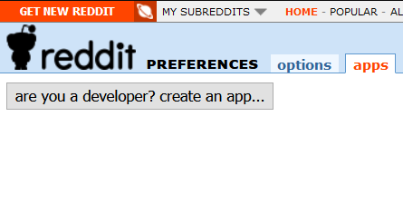
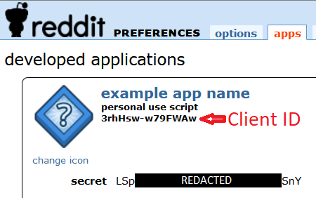
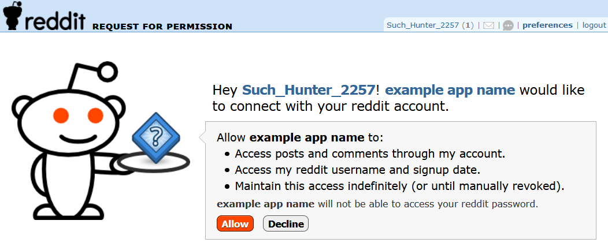
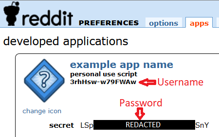
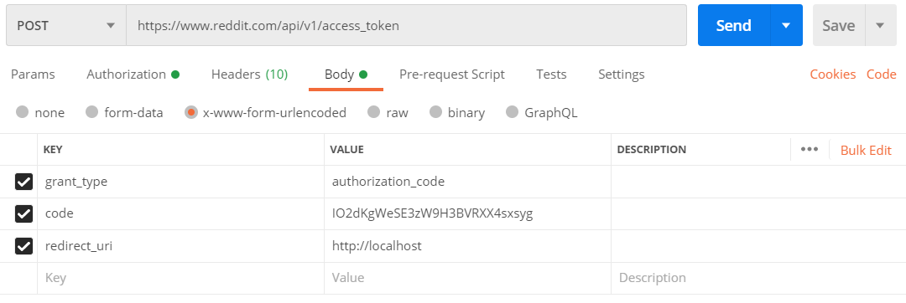

These instructions will get you going as fast as possible with a Reddit bot. Not all of the steps will ultimately be applicable to your goal, but hopefully once you've gotten an app set up the "real" app will be easier. To be clear, all this information is available in more detail here: https://github.com/reddit-archive/reddit/wiki/OAuth2 and a quick start here: https://github.com/reddit-archive/reddit/wiki/OAuth2-Quick-Start-Example

## Set up Reddit Application (kind of an account for a bot)

1. Log in to your Reddit account
2. Navigate to https://www.reddit.com/prefs/apps
3. You should see the option to create an application 



4. Give the app a reasonable name
5. Select "script"
6. Use "http://localhost" as the "redirect uri"
7. Select "create app"

You now have a Reddit application! This is kind of like a having a Reddit account, but for a robot. In the same way as your personal account doesn't really _do_ anything, your app doesn't really _do_ anything. You need a something to use your application, maybe e.g. with some custom logic and a Rust API wrapper...

## Set up Reddit bot
This part gets a bit more involved - you'll have to choose the permissions your application will have on behalf of your Reddit user.

### Authorize your app on your account
  1. You'll need your Client ID, it's the value on https://www.reddit.com/prefs/apps:

  

  2. Go to https://tobymurray.github.io/reddit-auth-generator/
  3. Ensure "Response Type" is "Code"
  4. "State" is a randomly generated string
  5. Redirect URI has to match the one configured in your Reddit app ("http://localhost")
  6. Ensure "Duration" is "Permanent"
  7. Select a few "Scopes", maybe: "Submit Content", "Read Content", and "My Identity"
     - Note, you'll have to redo this whole process to add/remove scopes, which sucks a bit
  8. Click "Submit", which will populate the "Output HREF" field
  9. Copy the value out of "Output HREF" and into your browser, in other words - navigate to it
  10. This should lead you to a page that looks something like below, click "allow"



### Obtain bearer token 
  1. You'll need a means to submit an HTTP POST, [Postman](https://www.postman.com/) fits the bill
  2. As soon as you click "allow", you'll be automatically redirected to localhost, so you should expect an "error" page. The URL you're looking at should be something like: `http://localhost/?state=uJSjnnrT&code=IO2dKgWeSE3zW9H3BVRXX4sxsyg`
  3. Grab the "code" value out of that URL, e.g. `IO2dKgWeSE3zW9H3BVRXX4sxsyg` in my example
  4. Submit an HTTP POST to `https://www.reddit.com/api/v1/access_token` with:  
    1. HTTP Basic Auth with username as client_id and password as client_secret.
    
    2. a `x-www-form-urlencoded` body containing three properties:  
      - `grant_type` with a value of `authorization_code`
      - `code` with a value of your code, e.g. `IO2dKgWeSE3zW9H3BVRXX4sxsyg`
      - `redirect_uri` with a value of `http://localhost`
      - if you're not using Postman, the body should look like: `grant_type=authorization_code&code=CODE&redirect_uri=http://localhost`
      
      
      - After submitting it, you'll get a response that looks like:
      ``` 
      {
        "access_token": "451343218227-g8gV5QNZyqlnacccXIuFoQ2ADuY",
        "token_type": "bearer",
        "expires_in": 3600,
        "refresh_token": "321343918127-ZGs3jysIV1EK3Zya6Zyy_4JYX5U",
        "scope": "identity read submit"
      }  
    
### Save your secrets!

You need to to keep track of both the access token and the refresh token. The refresh token is "permanent" and can be used to obtain access tokens. Access tokens are good for 60 minutes, and are used to interact with Reddit.

Collect the 4 values you'll need to get started with your Reddit bot:
  - Client ID
  - Client password
  - Access token
  - Refresh token

And get to botting! Remember to follow the [rules](https://github.com/reddit-archive/reddit/wiki/API#rules).